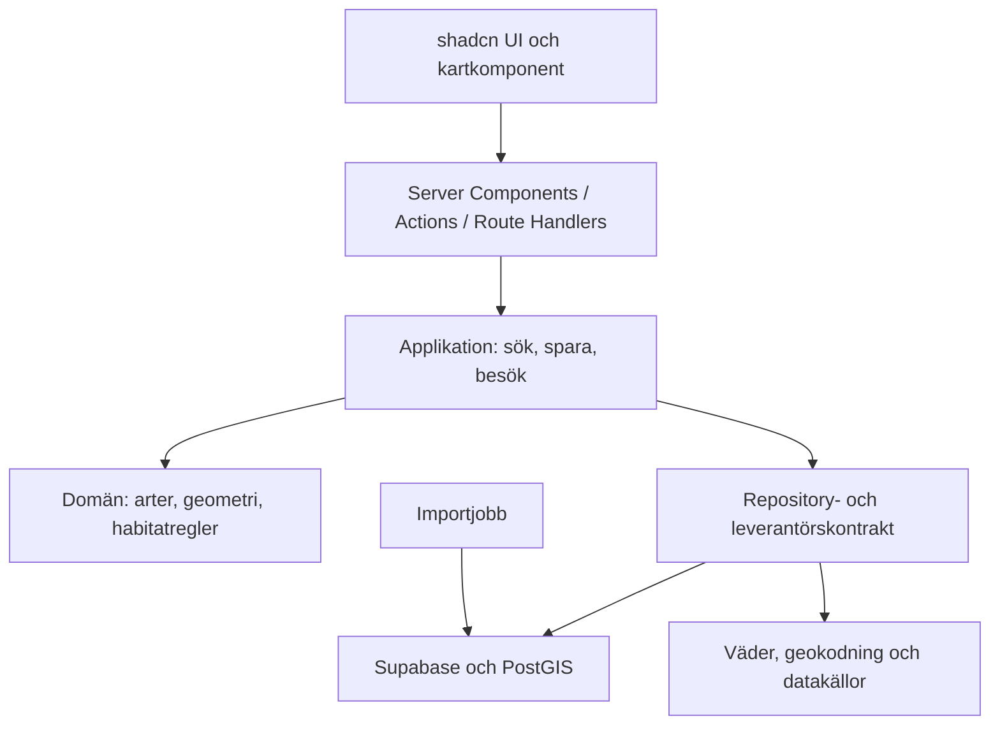

# Arkitektur och separation of concerns

## Teknisk riktning

Next.js App Router med TypeScript strict, React, shadcn/ui och Tailwind. Supabase hanterar PostgreSQL/PostGIS och Auth; Storage tillkommer med fotofunktionen. MapLibre GL JS är föreslagen kartrenderare, med separat vald leverantör för karttiles och geokodning. Ett modulärt kodrepo räcker; mikrotjänster behövs inte i MVP.

Välj aktuell stabil och stödd version vid byggstart, verifiera kompatibilitet och lås exakta beroenden i lockfil. Installera inte experimentella funktioner för att de är nya.

## Ansvarsgränser



SoC betyder här separation of concerns. Domänen känner inte till React, Next.js, Supabase eller HTTP. UI visar redan beräknade resultat och räknar inte habitatpoäng. Applikationslagret samordnar use cases. Infrastruktur översätter databas- och leverantörsformat till domänkontrakt. Detta är inte ett påstående om SOC 2-certifiering.

## Föreslagen struktur vid implementation

```text
src/
  app/                     # tunna routes, layouts och transportgränser
    (public)/utforska/
    (public)/arter/[slug]/
    (account)/sparat/
    (account)/profil/
    auth/callback/
    api/areas/search/
  components/ui/           # shadcn-primitiver
  features/
    exploration/           # ui, application, domain, server
    saved-areas/
    species/
    visits/
    account/
  infrastructure/
    supabase/              # separata server- och browserklienter
    repositories/
    providers/             # SLU, SMHI, kartor
  shared/                  # få, faktiskt delade typer och verktyg
  generated/database.ts
jobs/                      # schemalagda importer och förberäkning
supabase/                  # lokal config, migrations, seed, databastester
tests/                     # integration och E2E
projektplaner/
```

Feature-moduler använder varandras publika kontrakt, inte interna filer. Inför importregler i ESLint för domän/infrastruktur och server/client. Undvik generiska basklasser och ett stort osorterat `utils`-lager.

## Next.js-gränser

Server Components används för första datahämtning och artinnehåll. Klientkomponenter begränsas till karta, GPS, filter och interaktion. WebGL-kartan laddas vid behov i en klientgräns. Skicka endast serialiserbara DTO:er till klienten. Servermoduler märks `server-only`.

Server Actions hanterar formulärmutationer, med schema-validering och ägarkontroll vid varje anrop. Route Handler hanterar avbrytbar kart-/områdessökning. Server Components anropar applikationslagret direkt, inte den egna HTTP-routen. Browsern använder inte en privilegierad Supabase-klient.

SSR-auth byggs med `@supabase/ssr`, separata klienter och versionsrätt sessionsförnyelse. Följ aktuella officiella råd för verifierade claims och sessioner; att läsa `getSession()` är inte tillräcklig serverauktorisering. Auth- och privata svar får inte delas via CDN-cache. [Next.js](https://nextjs.org/docs/app/getting-started/server-and-client-components), [Supabase SSR](https://supabase.com/docs/guides/auth/server-side/creating-a-client).

## Kontrakt och cache

`SearchAreasInput`: taxon-ID, bbox eller centrum/radie, datum och begränsat antal resultat. Validera koordinater, storlek, datum och taxon på servern. Föreslagna MVP-gränser: max 50 km radie och 50 resultat; justeras efter lasttest. Avbryt gamla sökningar och begränsa frekvensen.

`AreaSuggestion`: områdes-ID, förenklad geometri, habitatklass, separat datakvalitet, förklaringskoder, modellversion, beräkningstid, källornas tidsstämplar och tillgängliga startpunkter. Saknade data representeras explicit, inte som nollvärden.

Publika resultat får cache baserad på taxon, normaliserat utsnitt, datum, modell- och datasetversion. Privata platser används aldrig i gemensamma cacheposter. Invalidation sker vid ny publicerad modell/import. Tid till ny beräkning syns i driftövervakningen.

Tunga rasterbearbetningar sker i batchjobb, aldrig under sidladdning. Börja med färdigbearbetade pilotdata. Välj jobbmiljö efter uppmätt minne, körtid och datastorlek; anta inte att stora GIS-importer ryms i en kort serverless-funktion.
